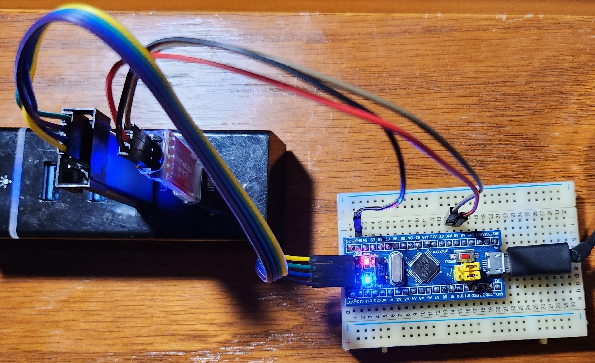
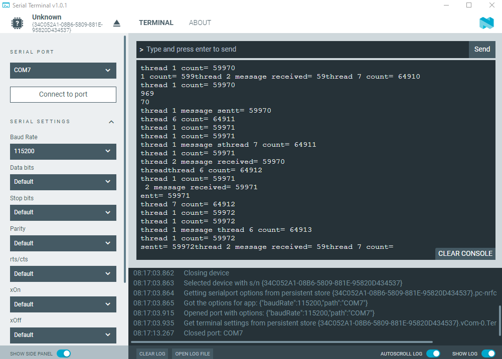
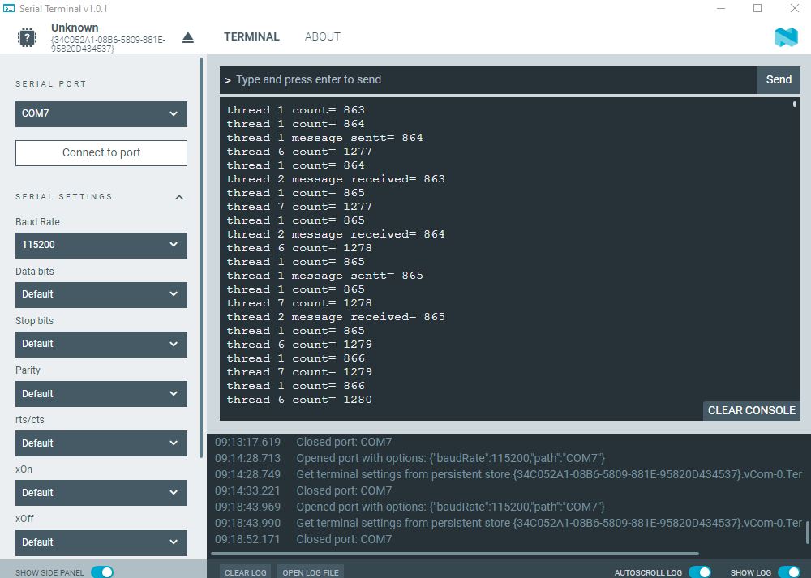

## ThreadX Project for stm32f103c8t6

This git repo contains libopencm3 and ThreadX+libopencm3 projects.
This provides a ready development environment for those who want to
apply the economical STM32F103 to using libopencm3 alone or in
concert with ThreadX.

## THIS PROJECT ONLY USES OPEN SOURCE TOOLS

No Windows based IDE environments are used or implied! Cygwin, Linux,
MacOS and \*BSD environments are suitable.

This project exists to bring several components together in a manner
that just works for the STM32F103.

## PROJECT STRUCTURE:

The subdirectory ./rtos contains projects that do use ThreadX (and
libopencm3).

    stm32f103c8t6/
        |- README.md
        |- LICENSE
        |- libopencm3/          git submodule
        |- threadx/             git submodule
        |- stm32f103c8t6.ld
        |- Makefile             makes all top-level projects
        |- Makefile.incl        rules for make file builds
        |- images               images of test bench setup and uart screenshot
        |- samples
            |- blink    gpio, uart, threadx sample

## PREREQUISITES:

    0a. It will be assumed here that you have your cross compiler
        toolchain installed. In Makefile.incl you'll see references
        to a PREFIX variable. This defaults to arm-none-eabi so that
        gcc for example will be arm-none-eabi-gcc etc. If your
        prefix differs, edit Makefile.incl at the top level to
        match, or use the shell: export PREFIX=whatever

    0b. It is also assumed that you have the st-link command installed
        on your system. You may need to download and install it.
        Google is your friend.

    1.  If you didn't use a --recursive git clone, then you need to make
        sure that libopencm3 is fetched now. From the top level apply
        one of:

            $ git submodule update --init --recursive   # First time

            $ git submodule update --recursive          # Subsequent

    2.  At the top level, do a "make" so that the projects get built.
        Do a "make clobber" first, if you need to rebuild.

## TEST EXAMPLES:

    $ make

will build your blink example.

### Test bench setup:

### UART output sceenshot

#### UART has not ThreadX synchronization

#### UART has mutex synchronization

## LICENSE:

All files covered by _this_ repo (_except_ those copied from libopencm3
and ThreadX, or otherwise marked), are covered by the GNU Lesser
General Public License Version 3. See the file named LICENSE.
